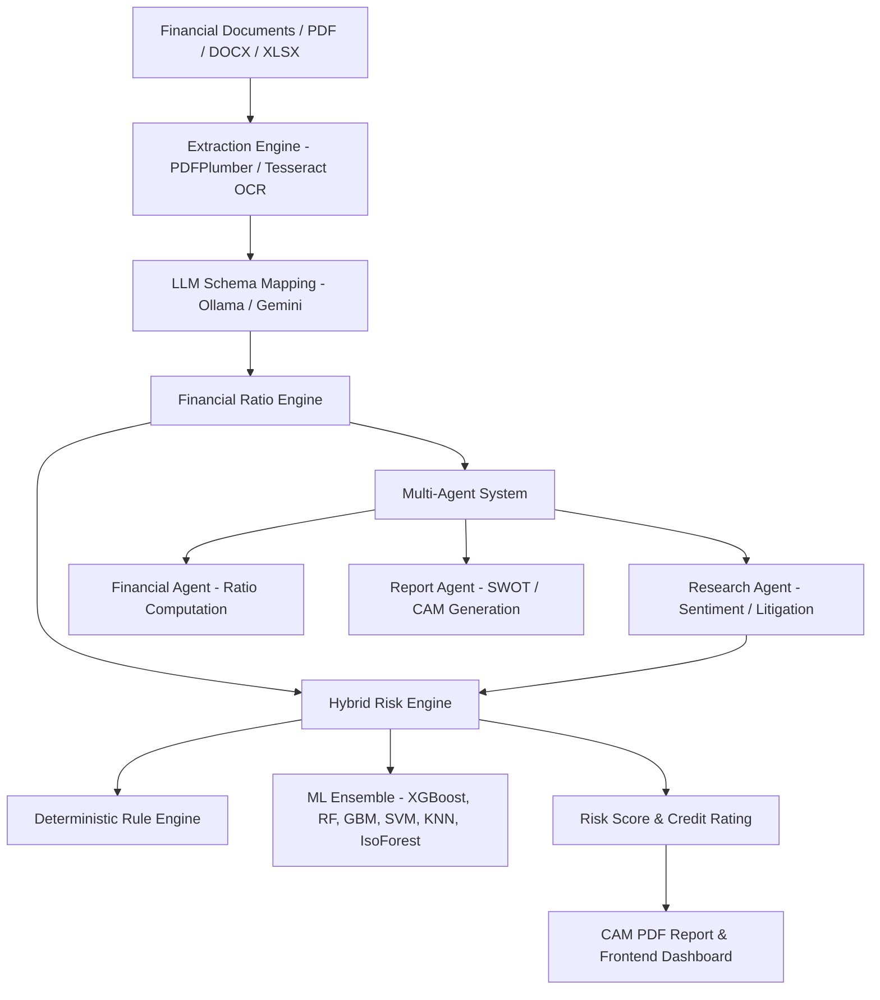

# IntelliCredit: AI-Powered Corporate Credit Intelligence Platform

**IntelliCredit** is an autonomous, end-to-end AI-driven corporate credit underwriting and risk assessment platform. Designed for banks, fintechs, and credit analysts, IntelliCredit automates document extraction, calculates comprehensive financial ratios, monitors external corporate risk signals via LLM agents, and applies hybrid ML scoring to generate complete **Credit Assessment Memorandums (CAM)** and PDF reports.

---

## Key Features

- **Intelligent Document Ingestion & Extraction**
  - Parses structured and unstructured corporate financial statements (PDF, DOCX, XLSX).
  - OCR integration via Tesseract for scanned balance sheets and income statements.
  - LLM-assisted schema mapping (supports local **Ollama** `qwen3:8b` or cloud **Google Gemini** `gemini-2.0-flash`).

- **Automated Financial Ratio Engine**
  - Evaluates solvency, liquidity, leverage, and debt coverage.
  - Key metrics include **Altman Z-Score**, **Interest Coverage Ratio**, **Debt-to-Equity (D/E)**, **Current Ratio**, **Net Profit Margin**, and **Operating Cash Flow (OCF)**.

- **Multi-Agent Research & Analysis**
  - **Research Agent**: Scans news and public records for sentiment, litigation flags, governance alerts, and debt distress signals.
  - **Financial Agent**: Computes ratios and applies distress labeling.
  - **Report Agent**: Auto-generates structured **SWOT analyses** and detailed Credit Assessment Memorandums (CAM).

- **Hybrid Risk Scoring & Machine Learning Engine**
  - Blends deterministic credit rule frameworks with a machine learning ensemble.
  - Ensembles **XGBoost**, **Random Forest**, **Gradient Boosting Machine (GBM)**, **SVM**, **K-Nearest Neighbors (KNN)**, **Logistic Regression**, and **Isolation Forest** (for anomaly detection).
  - Features dynamic model retraining (`ml_trainer.py`) on newly extracted loan samples.

- **CAM & PDF Report Export**
  - Automated PDF generation of Credit Assessment Memorandums using **ReportLab**.

- **Modern Web Dashboard**
  - Interactive single-page dashboard for entity management, document uploads, real-time risk scoring, ratio visualizations, and SWOT inspection.

---

## Architecture & Workflow



---

## Directory Structure

```text
├── agents/                  # LLM AI Agents
│   ├── financial_agent.py   # Computes ratios & extracts financial signals
│   ├── research_agent.py    # News, sentiment & risk signal research
│   └── report_agent.py      # SWOT & CAM markdown/PDF generator
├── api/                     # FastAPI Endpoints & Routers
│   └── routes/
│       ├── analysis.py      # Run analysis pipeline
│       ├── documents.py     # Document upload & management
│       ├── entities.py      # Borrower entity CRUD
│       └── ml.py            # Model training & metadata endpoints
├── config/                  # Configuration & Environment Settings
│   └── settings.py          # Pydantic Settings (Ollama / Gemini / Paths)
├── core/                    # Core Business Logic & Orchestrators
│   ├── analysis_orchestrator.py # Full analysis pipeline execution
│   ├── extraction_engine.py    # Document text & table parsing
│   └── store.py                # In-memory application store
├── engines/                 # Analytical & Machine Learning Engines
│   ├── ml_trainer.py        # ML training pipeline across 7 algorithms
│   └── risk_scoring_engine.py# Hybrid rule-based + ML risk scorer
├── frontend/                # Single-Page Web Dashboard
│   └── index.html           # Dashboard layout & interactivity
├── models/                  # Saved ML model artifacts (.pkl, .json)
├── reports/                 # Generated PDF Credit Assessment Memorandums
├── uploads/                 # Uploaded financial documents
├── utils/                   # LLM clients (Ollama & Gemini wrappers)
├── main.py                  # FastAPI Application Entry Point
├── requirements.txt         # Project Dependencies
└── .env                     # Environment variables configuration
```

---

## Quick Start

### 1. Prerequisites

- **Python 3.10+**
- (Optional) **Ollama** installed locally if using local LLMs (e.g. `ollama run qwen3:8b`).
- (Optional) **Tesseract OCR** installed at `C:\Program Files\Tesseract-OCR\tesseract.exe` (or configured via `.env`).

### 2. Installation

1. **Clone the repository:**
   ```bash
   git clone https://github.com/Shivang26-06-2005/IntelliCredit.git
   cd IntelliCredit
   ```

2. **Create and activate a virtual environment:**
   ```bash
   # Windows (PowerShell)
   python -m venv venv
   .\venv\Scripts\Activate.ps1

   # Linux/macOS
   python3 -m venv venv
   source venv/bin/activate
   ```

3. **Install dependencies:**
   ```bash
   pip install -r requirements.txt
   ```

### 3. Environment Configuration

Create a `.env` file in the root directory:

```env
# Application Settings
APP_NAME=IntelliCredit
APP_ENV=development
DEBUG=True

# LLM Provider: "ollama" or "gemini"
LLM_PROVIDER=ollama

# Ollama Settings (Local)
OLLAMA_BASE_URL=http://localhost:11434
OLLAMA_MODEL=qwen3:8b

# Gemini Settings (Cloud - Optional)
GEMINI_API_KEY=your_gemini_api_key_here
GEMINI_MODEL=gemini-2.0-flash

# Storage & Utilities
UPLOAD_DIR=./uploads
REPORTS_DIR=./reports
TESSERACT_CMD=C:\Program Files\Tesseract-OCR\tesseract.exe
```

### 4. Running the Application

Start the FastAPI server:

```bash
uvicorn main:app --reload --port 8000
```

- **API Documentation**: Open [http://localhost:8000/docs](http://localhost:8000/docs) (Swagger UI).
- **Web Dashboard**: Open [http://localhost:8000/frontend/index.html](http://localhost:8000/frontend/index.html) or launch `frontend/index.html` directly in your web browser.

---

## API Reference Highlights

| Method | Endpoint | Description |
| :--- | :--- | :--- |
| `GET` | `/health` | API health check & active LLM model status |
| `POST` | `/api/v1/entities` | Register a new corporate entity |
| `POST` | `/api/v1/documents/upload` | Upload balance sheet / financial docs |
| `POST` | `/api/v1/analysis/run/{loan_id}` | Trigger full automated analysis workflow |
| `GET` | `/api/v1/analysis/report/{loan_id}` | Fetch CAM report & risk score summary |
| `POST` | `/api/v1/ml/train` | Retrain ML models on collected data samples |

---
